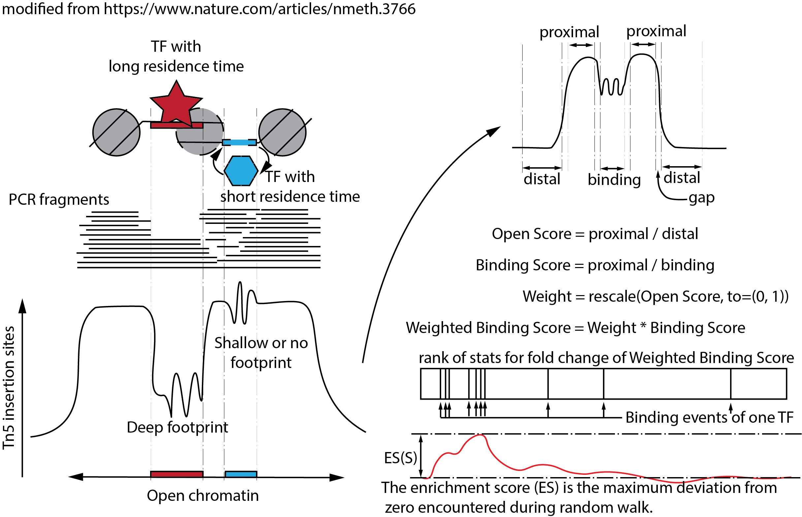

```{r, echo=FALSE, results="hide", warning=FALSE, message=FALSE}
suppressPackageStartupMessages({
  library(ATACseqTFEA)
  library(BSgenome.Drerio.UCSC.danRer10)
  library(Rsamtools)
  library(ATACseqQC)
})
knitr::opts_chunk$set(warning=FALSE, message=FALSE, fig.width=5, fig.height=3.5)
```

# Introduction

ATAC-seq, an assay for Transposase-Accessible Chromatin using sequencing, is a
widely used technique for chromatin accessibility analysis. 
Detecting differential activation of transcription factors between two 
different experiment conditions provides the possibility of decoding the 
key factors in a phenotype. Lots of tools have been developed to detect 
the differential activity of TFs (DATFs) for different groups of samples. 
Those tools can be divided into two groups. One group detects DATFs from 
differential accessibility analysis, such as MEME[@bailey2006meme],
HOMER[@heinz2010simple], enrichr[@chen2013enrichr], and ChEA[@lachmann2010chea].
Another group finds the DATFs by enrichment tests, such as
BiFET[@youn2019bifet], diffTF[@berest2019quantification], and TFEA[@rubin2020transcription].
For single-cell ATAC-seq analysis, Signac and chromVar are widely used tools.

# Motivation

All of these tools detect the DATF by only considering the open status of 
chromatin. None of them take the TF footprint into count. The open status 
provides the possibility of TF can bind to that position. 
The TF footprint by ATAC-seq shows the status of TF bindings. 

To help researchers quickly assess the differential activity of hundreds of TFs
by detecting the difference in TF footprint via enrichment
score[@subramanian2005gene],
we have developed the _ATACseqTFEA_ package. 
The _ATACseqTFEA_ package is a robust and reliable computational tool to
identify the key regulators responding to a phenotype. 



# Quick start

Here is an example using _ATACseqTFEA_ with a subset of ATAC-seq data.

## Installation
First, install _ATACseqTFEA_ and other packages required to run 
the examples.
Please note that the example dataset used here is from zebrafish. 
To run an analysis with a dataset from a different species or different assembly, 
please install the corresponding Bsgenome and "TxDb".
For example, to analyze mouse data aligned to "mm10", 
please install "BSgenome.Mmusculus.UCSC.mm10", 
and "TxDb.Mmusculus.UCSC.mm10.knownGene". 
You can also generate a TxDb object by 
functions `makeTxDbFromGFF` from a local "gff" file,
or `makeTxDbFromUCSC`, `makeTxDbFromBiomart`, and `makeTxDbFromEnsembl`, 
from online resources in the _GenomicFeatures_ package.

```{r, eval=FALSE}
library(BiocManager)
BiocManager::install(c("ATACseqTFEA", 
                       "Rsamtools",
                       "BSgenome.Drerio.UCSC.danRer10",
                       "TxDb.Drerio.UCSC.danRer10.refGene"))
```

## load library

```{r}
library(ATACseqTFEA)
library(BSgenome.Drerio.UCSC.danRer10) ## for binding sites search
library(ATACseqQC) ## for footprint
```

## prepare binding sites

To do TFEA, there are two inputs, the binding sites, and the change ranks.
To get the binding sites, the _ATACseqTFEA_ package provides the 
`prepareBindingSites` function. Users can also try to get the binding sites
list by other tools such as "fimo"[@grant2011fimo].

The `prepareBindingSites` function request a cluster of position weight matrix 
(PWM) of TF motifs. _ATACseqTFEA_ prepared a merged `PWMatrixList` for 
405 motifs. The `PWMatrixList` is a collection of jasper2018, jolma2013 and
cisbp_1.02 from package motifDB (v 1.28.0) and merged by distance smaller than
1e-9 calculated by MotIV::motifDistances function (v 1.42.0). 
The merged motifs were exported by motifStack (v 1.30.0).

```{r}
motifs <- readRDS(system.file("extdata", "PWMatrixList.rds",
                               package="ATACseqTFEA"))
```

Another full list of non-redundant TF motifs are also available by downloading
the data from [DeepSTARR](https://github.com/bernardo-de-almeida/motif-clustering)[@de2021deepstarr]. There are 6502 motifs in the data set.
```{r}
fullListMotifs <- readRDS(system.file("extdata", "cluster_PWMs.rds",
                                      package="ATACseqTFEA"))
fullListMotifs
```

To scan the binding sites along a genome, a `BSgenome` object is required by
the `prepareBindingSites` function.

```{r}
# for test run, we use a subset of data within chr1:5000-100000
# for real data, use the merged peaklist as grange input.
# Drerio is the short-link of BSgenome.Drerio.UCSC.danRer10
seqlev <- "chr1" 
bindingSites <- 
  prepareBindingSites(motifs, Drerio, seqlev,
                      grange=GRanges("chr1", IRanges(5000, 100000)),
                      p.cutoff = 5e-05)#set higher p.cutoff to get more sites.
```


## do TFEA

The shifted bam files by ATACseqQC::shiftGAlignmentsList[@ou2018atacseqqc] 
(for paired-end) or  shiftGAlignments (for single-end) of the
experiment and control group are required for the changing ranks, 
which is required by TFEA. The samples must be at
least biologically duplicated.

```{r}
bamExp <- system.file("extdata",
                      c("KD.shift.rep1.bam",
                        "KD.shift.rep2.bam"),
                      package="ATACseqTFEA")
bamCtl <- system.file("extdata",
                      c("WT.shift.rep1.bam",
                        "WT.shift.rep2.bam"),
                      package="ATACseqTFEA")
res <- TFEA(bamExp, bamCtl, bindingSites=bindingSites)
```

## view results


```{r}
## volcanoplot
ESvolcanoplot(TFEAresults=res)
### plot enrichment score for one TF
TF <- "Tal1::Gata1"
print(plotES(res, TF=TF, outfolder=NA))
## footprint
bs <- getBindingSites(res)
bs <- bs[vapply(bs$motif, 
                FUN=function(.ele) TF %in% .ele,
                FUN.VALUE = logical(1L))]
bs$score <- mapply(bs$score, bs$motif, FUN = function(score, motif){
  max(score[motif==TF])
})
sigs <- factorFootprints(c(bamCtl, bamExp), 
                         pfm = as.matrix(motifs[[TF]]),
                         bindingSites = bs,
                         seqlev = seqlev, genome = Drerio,
                         upstream = 100, downstream = 100,
                         group = rep(c("WT", "KD"), each=2))
## export the results into a csv file
#write.csv(res$resultsTable, "enrichment.csv", 
#          row.names=FALSE)

```


# Real data

```{r eval=FALSE}
## load library
library(ATACseqTFEA)
library(rtracklayer)
motifs <- readRDS(system.file("extdata", "PWMatrixList.rds",
                               package="ATACseqTFEA"))
library(BSgenome.Drerio.UCSC.danRer10)
library(TxDb.Drerio.UCSC.danRer10.refGene)
genes <- genes(TxDb.Drerio.UCSC.danRer10.refGene)
## only search the ranges for peaks.
seqlev <- paste0("chr", 1:25)
peaks <- lapply(peak_files, import, format="narrowPeak")
peaks <- reduce(unlist(GRangesList(peaks)))
mts <- prepareBindingSites(fullListMotifs, Drerio, seqlev, 
                           grange=peaks, 
                           p.cutoff = 1e-05)
bamExp <- dir("bam", pattern = "treatment_group_key_words",
              full.names = TRUE)
bamCtl <- dir("bam", pattern = "control_group_key_words",
              full.names = TRUE)
res <- TFEA(bamExp, bamCtl, bindingSites=mts)
## get all the enrichment score plots
dir.create("ESplots")
g <- plotES(res, outfolder="ESplots")
## volcanoplot
pdf("volcanoplot.pdf")
ESvolcanoplot(TFEAresults=res)
dev.off()
## plot the footprint
library(ATACseqQC)
outfolder <- "footprint"
dir.create(outfolder)
for(TF in res$resultsTable$TF[res$resultsTable$adjPval<0.05]){
  bs <- getBindingSites(res)
  bs <- bs[vapply(bs$motif, 
                FUN=function(.ele) TF %in% .ele,
                FUN.VALUE = logical(1L))]
  bs$score <- mapply(bs$score, bs$motif, FUN = function(score, motif){
    max(score[motif==TF])
  })
  pdf(file.path(outfolder, paste(TF, ".pdf")))
  factorFootprints(c(bamCtl, bamExp), 
                   pfm = as.matrix(motifs[[TF]]),
                   bindingSites = bs,
                   seqlev = seqlev, genome = Drerio,
                   upstream = 100, downstream = 100,
                   group = rep(c("WT", "KD"),
                               c(length(bamCtl), length(bamExp))))
  dev.off()
}

## export the results into a csv file
write.csv(res$resultsTable, "enrichment.csv", 
          row.names=FALSE)
```

# SessionInfo

```{r}
sessionInfo()
```


# References
